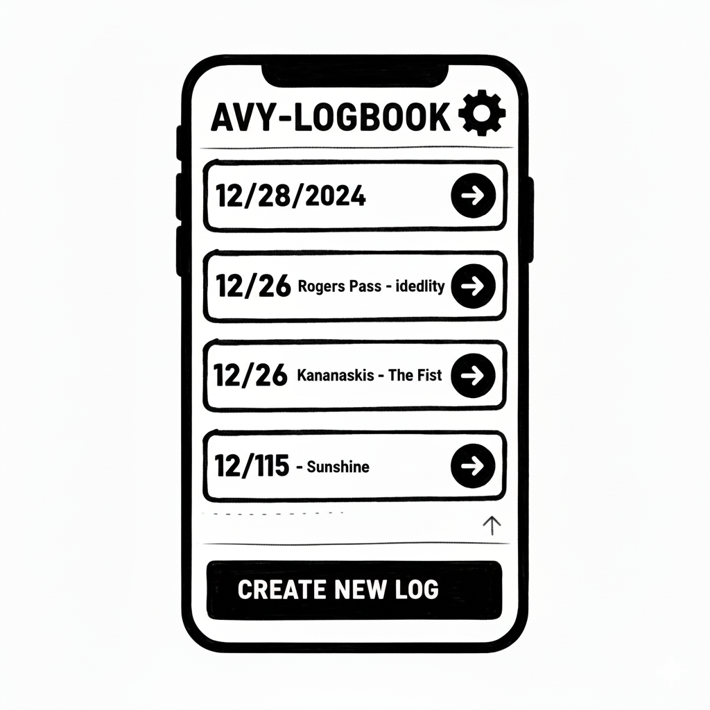

# Avy-Logbook

This is a free offline app inspired by the Decision making in Avalanche Terrain by Avalanche Canada.
The goal of this is to create an easy to use (in cold weather/with gloves) logbook that highlights field observations to aid in safe decision making.

## Technical Overview

This app is built in Rust + Typescript (On Deno) with Tauri, SvelteKit, DaisyUI, Vite and Sqlite.
Designed to function entirely offline as cell phone signal is often not existent in the backcountry.

### Front End Design

The root level page is a simple with just a list of previous trips containing the location of the trip and the date.
On that page there is also a large button to create new logs and potentially in the future a settings gear for a page.

Either selecting a previous trip or creating a new trip will bring the user to the trip edit page.
On the top it will have the name and date, with a pencil icon on the top right, if open pops up editing modal.
If this is being created for the first time then name and date editing modal is automatically opened.

On the trip page there are 3 sections:

#### Avalanche Forecast and Problems

Contains the following information.
Forecast for:

- Alpine (ALP): Low, Moderate, **Considerable**, **_High_**, **_Extreme_**, **_Unknown_**
- Tree Line (TL): Low, Moderate, **Considerable**, **_High_**, **_Extreme_**, **_Unknown_**
- Below Tree Line (BTL): Low, Moderate, **Considerable**, **_High_**, **_Extreme_**, **_Unknown_**

Macro Trends: Decreasing, Steady, **Melt-Freeze (MF)**, **Increasing**, **Unknown**

Confidence: High, Moderate, **Low**, **Unknown**

Avalanche Problems, section for each Alpine, Tree Line, Below Tree Line:

- Loose Dry (LD)
- Loose Wet (LW)
- Wet Slab (WT)
- Cornices (CO)
- **Wind Slabs (WD)**
- **Storm Slabs (SS)**
- **_Persistent Slabs (PS)_**
- **_Deep Persistent Slabs (DP)_**

And then also a generic comment box.

These are going to be filled out ahead of time in the field with access to the avalanche forecast so the UI can be a bit more compressed.
Perhaps it might need a different edit UI compared to viewing UI on the trip page. Perhaps a pre-trip wizard?

#### Field Observations

The first weather section is also repeated in the trip planning with the expected forecast

Weather:

- Precipitation :
  - Nothing
  - S-1 (Light snowfall <= 1 cm/hr)
  - RL (Light Rain)
  - S2 (Moderate snowfall 2 cm/hr)
  - R (Rain)
  - S3+ (Heavy snowfall >= 3 cm/hr)
  - Unknown
- Accumulation:
  - 0
  - <20
  - 20-40
  - \>40
  - Unknown
- Wind Speed:
  - Calm
  - Light (1-25 km/h)
  - Moderate (26-40 km/h)
  - Strong (41-60 km/h)
  - Extreme (>60 km/h)
  - Unknown
- Wind Direction:
  - N
  - NE
  - E
  - SE
  - S
  - SW
  - W
  - NW
  - Unknown
- Solar Radiation:
  - None
  - Weak
  - Moderate
  - Strong
  - Unknown

Avalanche Activity:

- Size:
  - None
  - <= 1
  - 1.5-2
  - \>= 2.5
  - Unknown
- Trigger:
  - Heavy
  - Moderate
  - Light
  - Natural
  - Unknown
- Characteristic:
  - Loose Dry (LD)
  - Loose Wet (LW)
  - Wet Slab (WT)
  - Cornices (CO)
  - **Wind Slabs (WD)**
  - **Storm Slabs (SS)**
  - **_Persistent Slabs (PS)_**
  - **_Deep Persistent Slabs (DP)_**

Signs of Instability:

- See/Feel
  - None
  - Drum
  - Crack
  - Whumpf
- Compression Test:
  - None
  - Failure
  - Pop/Drop
- ECT Test:
  - None
  - Failure
  - Pop/Drop

#### Trip Information:

There is just a bunch of questions for trip prep that helps frame the trip:

1. Given the forecast, what areas are especially important to avoid? (multi select answer)
   - Terrain Traps
   - Start zones
   - Avy Paths
   - Runout Zones
   - 30-35 slope
   - \> 35 slope
   - Convex / Unsupported
   - Lee / Loaded
   - Sunny
   - Slope size/expected avy size (Large, Medium, Small)
   - Overhead Hazard
2. Has the trip plan been left with someone?
   - Checkbox
3. Thought about decision points?
   - Checkbox
   - Comment box

### Overall flow:

When the user creates a new trip they need to do the following:

1. Set the location (name) and date (default to today's date, mostly it is likely done the night before though)
2. Fill in the avalanche forecast information
3. Fill in the weather forecast information
   - Includes weather and avalanche activity
4. Fill in the trip information.

At this point the trip pre-work is done. Each one of these will have its own edit page. When wizard is complete it goes to the trip overview page which shows a compressed summary of this information. The edit page for each of these can be returned to by hitting the edit button next to the section title.

From the trip overview page there is a button to add a new observation:
Each observation has time (default to current time, allow editing)

- Weather
- Avalanche activity
- Signs of Instability
- Comment box

### Future improvements:

- [ ] Data export
- [ ] Allow photos
- [ ] Wind rose diagrams
- [ ] Geo-location saving for observations

### Recommended Editor Setup

[VS Code](https://code.visualstudio.com/) + [Svelte](https://marketplace.visualstudio.com/items?itemName=svelte.svelte-vscode) + [Tauri](https://marketplace.visualstudio.com/items?itemName=tauri-apps.tauri-vscode) + [rust-analyzer](https://marketplace.visualstudio.com/items?itemName=rust-lang.rust-analyzer).

Helpful commands:

- Run: `deno task tauri dev`
- Run mobile development: `deno task tauri [android|ios] dev --open`
